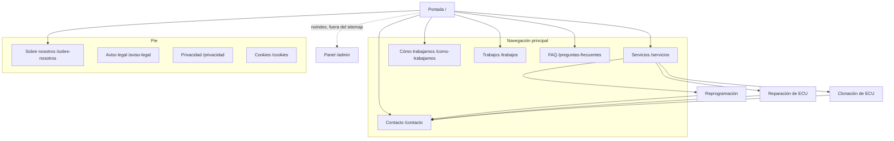

# Arquitectura de la web pública — JM Repro Cars

Fase 1 del frontend. Define URLs, jerarquía y navegación **antes** de diseñar, para
no tener que cambiar direcciones más adelante.

Elaborado con la skill `site-architecture`. Nada de lo que hay aquí está desplegado.

---

## 1. Objetivos de la web pública

Por orden de importancia:

1. **Convertir a WhatsApp.** El negocio ya funciona por WhatsApp y el backend está
   construido alrededor de ese flujo. La web existe para que un visitante entienda
   qué se hace y abra una conversación con contexto útil (vehículo, síntoma, fotos
   del error).
2. **Dar credibilidad técnica.** El público principal son otros talleres. Necesitan
   ver competencia real, no marketing genérico.
3. **Ser encontrable.** Búsquedas de servicio y de problema concreto («reparar
   centralita», «clonar ECU», «error DTC no arranca»).
4. **Sostener el crecimiento.** La estructura debe admitir casos reales, preguntas
   frecuentes y contenido técnico sin rehacer URLs.

**No** es objetivo de esta fase vender online. La tienda WooCommerce de la web
antigua queda fuera hasta que se confirme (§8).

---

## 2. Audiencias

Marcadas explícitamente: **solo la primera está confirmada** por el modelo de negocio
y el flujo de WhatsApp ya implementado. Las demás son hipótesis a validar con el
cliente.

| Audiencia | Estado | Qué busca | Qué necesita encontrar |
|---|---|---|---|
| **Talleres y profesionales** | Confirmada — la web antigua dice literalmente «Ofrecemos sobre todo para talleres» | Resolver una avería que no pueden cerrar | Qué servicios hay, qué datos enviar, contacto rápido |
| Particulares con avería | Hipótesis | Que su coche vuelva a arrancar | Explicación en lenguaje llano, confianza, contacto |
| Particulares de tuning | Hipótesis | Más potencia | Qué es una reprogramación, límites legales |
| Competición | Hipótesis — la web antigua menciona «vehículos de competición» | Anulaciones y preparaciones específicas | Alcance real y advertencia legal |

**Consecuencia de diseño:** la portada debe funcionar para un profesional con prisa
*y* para un particular desorientado. Se resuelve con jerarquía, no con dos webs:
titular claro, servicios explícitos, y un camino corto a WhatsApp desde cualquier
punto.

---

## 3. Sitemap público recomendado

Estado: ✅ implementada · ◻︎ planificada

```
Portada (/)                                              ✅
├── Servicios (/servicios)                               ✅
│   ├── Reprogramación (/servicios/reprogramacion)       ✅
│   ├── Reparación de ECU (/servicios/reparacion-ecu)    ◻︎
│   └── Clonación de ECU (/servicios/clonacion-ecu)      ◻︎
├── Cómo trabajamos (/como-trabajamos)
├── Trabajos (/trabajos)                    ← fase posterior
│   └── Caso (/trabajos/{slug})             ← fase posterior
├── Preguntas frecuentes (/preguntas-frecuentes)
├── Sobre nosotros (/sobre-nosotros)
├── Contacto (/contacto)
└── Legal
    ├── Aviso legal (/aviso-legal)
    ├── Privacidad (/privacidad)
    └── Cookies (/cookies)
```

Dos niveles como máximo. Toda página relevante queda a un clic de la portada, muy
por debajo de la regla de los tres clics. Es un sitio de negocio local pequeño: no
necesita más profundidad y añadirla solo escondería contenido.

### Visual



---

## 4. Jerarquía de navegación

### Cabecera

**Regla:** la cabecera solo muestra destinos que sean **una página pública
real**. Un enlace en la barra principal promete una página; llevar a un ancla
dentro de otra rompe esa promesa, y además hace que dos secciones compitan con
la página que las contiene.

```
[BrandMark]   Servicios   Reprogramación        [WhatsApp]
```

«Cómo trabajamos» y «Preguntas» **se han retirado de la cabecera**: eran anclas
de `/servicios`. Siguen alcanzables desde el pie, desde el menú móvil y desde
enlaces contextuales, que es donde ayudan sin engañar.

De los tres servicios, solo **Reprogramación** tiene página propia, así que solo
él aparece. **Tampoco hay desplegable bajo «Servicios»**: un menú que se abre
para enseñar un único destino real es peor que una lista plana. Cuando existan
`/servicios/reparacion-ecu` y `/servicios/clonacion-ecu` se replantea, y
entonces el desplegable sí tendrá sentido.

El campo `page` de cada servicio en `web/src/config/site.ts` gobierna esto: la
cabecera se construye filtrando por él, así que crear una de las otras dos
páginas la añade sola.

- `Servicios` despliega los tres servicios confirmados. Con solo tres hijos, el
  desplegable es innecesario en móvil: allí se expanden en la navegación.
- `Trabajos` **no se muestra hasta que existan casos reales autorizados**. Aparece en
  la arquitectura para reservar la URL, no en la interfaz. La portada tampoco
  reserva ya un hueco visible para esa sección: el recuadro vacío que anunciaba
  su ausencia se sustituyó por el bloque de entrada («qué conviene enviarnos»),
  que sí tiene contenido verdadero. La URL sigue reservada.
- La llamada a la acción es un botón a WhatsApp, siempre el último por la derecha.
- El `BrandMark` enlaza a `/`.

### Pie

**Un único bloque oscuro**, dividido internamente por líneas, no por cambios de
fondo: marca, servicios, empresa, contacto y franja legal. Encadenar varias
bandas oscuras hace que parezcan varios pies de página.

| Marca | Servicios | Empresa | Contacto |
|---|---|---|---|
| Descripción breve | Todos los servicios | Cómo trabajamos | WhatsApp |
| | Los tres servicios | Preguntas habituales | |

Las páginas legales se añadirán cuando existan los datos fiscales del cliente.

### Migas de pan

En las páginas de nivel 2 (`/servicios/*` y, más adelante, `/trabajos/*`). Reflejan
exactamente la ruta de la URL:

```
Inicio > Servicios > Reprogramación
```

Cada segmento enlaza salvo el actual. No se ponen en la portada ni en las páginas de
nivel 1: no aportan nada y añaden ruido.

---

## 5. Patrones de URL

| Regla | Decisión |
|---|---|
| Idioma | Castellano. El público es español; los slugs también |
| Separador | Guion medio |
| Mayúsculas | Nunca. `/Servicios` redirige a `/servicios` |
| Barra final | **Sin barra final.** `/servicios/` redirige a `/servicios` |
| Fechas en URL | No. La web antigua tenía `/2025/02/28/hello-world/`; no se repite |
| Identificadores | No. Slugs legibles siempre |
| Profundidad | Máximo dos niveles |

**Mientras no existan las páginas individuales de servicio**, los enlaces
apuntan a anclas dentro de `/servicios` (`#reprogramacion`, `#reparacion-ecu`,
`#clonacion-ecu`). Ningún enlace del sitio apunta a una página inexistente. Las
URLs individuales quedan reservadas: cuando se creen, las anclas redirigen.

| Tipo de página | Patrón | Ejemplo |
|---|---|---|
| Portada | `/` | `/` |
| Hub de servicios | `/servicios` | `/servicios` |
| Servicio | `/servicios/{slug}` | `/servicios/reparacion-ecu` |
| Página simple | `/{slug}` | `/como-trabajamos` |
| Caso real (futuro) | `/trabajos/{slug}` | `/trabajos/audi-a3-egr` |
| Legal | `/{slug}` | `/privacidad` |
| Panel privado | `/admin`, `/admin/{sección}` | `/admin/solicitudes` |

**Sobre la barra final:** la web antigua es WordPress y usa barra final en todo. La
nueva usa `trailingSlash: "never"` en Astro con `build.format: "file"`, de modo que
cada ruta genera un `.html` servido sin barra. **Requiere una regla en el servidor
web** cuando llegue el reverse proxy: redirección 301 de `/ruta/` a `/ruta`. Queda
anotado como dependencia de la fase de despliegue.

---

## 6. Estrategia de enlaces internos

No hay blog ni cientos de páginas, así que el modelo hub-and-spoke se aplica en
pequeño y sin artificios.

**Hub: `/servicios`.** Enlaza a los tres servicios; cada servicio enlaza de vuelta al
hub por las migas y **lateralmente a los otros dos** («¿No es esto lo que necesitas?
Mira también…»). Esto evita que las tres páginas queden aisladas entre sí, que es el
fallo típico de estas estructuras.

**Reglas que se aplican:**

- Ninguna página huérfana: todas cuelgan de la cabecera, del pie o del hub.
- Texto de enlace descriptivo. Nunca «pincha aquí» ni «leer más» sueltos: el enlace
  dice a dónde va («ver cómo reparamos una centralita»).
- La portada enlaza a los tres servicios por su nombre, no a `/servicios` solamente.
- `/como-trabajamos` enlaza a los tres servicios y al contacto: es la página que
  convierte al indeciso.
- Cuando existan casos reales, cada caso enlazará al servicio que le corresponde, y
  cada servicio mostrará sus casos. Ese enlace cruzado es el que da valor a
  `/trabajos`, y es la razón de reservar ya la URL.
- Las páginas legales se enlazan solo desde el pie. No compiten por atención.

**Enlaces que la web pública NO debe tener:** ninguno a `/admin`. El panel no se
anuncia (§9).

---

## 7. Inventario de la web antigua

Recogido de `sitemap_index.xml` y de las páginas el 2026-08-20. Sirve para no perder
direcciones, no como referencia de diseño ni de contenido.

| URL antigua | Qué es | Estado observado |
|---|---|---|
| `/` | Portada | Activa |
| `/services/` | Servicios | Activa. Lista DTCs, reparaciones internas, repros, pop&bang/hardCut, anulaciones, immo off |
| `/about/` | Sobre nosotros | Activa. Contiene afirmaciones a verificar (§8) |
| `/contact/` | Contacto | Activa. WhatsApp y correo; avisa de que el buzón está «temporalmente deshabilitado» |
| `/sample-page/` | Enlazada en el menú como **«Repros»** | Slug por defecto de WordPress. URL de baja calidad |
| `/team/` | Equipo | En el sitemap; contenido de plantilla |
| `/blog/` | Índice del blog | Un solo post |
| `/2025/02/28/hello-world/` | Post de ejemplo de WordPress | Contenido de plantilla |
| `/tienda/` | Tienda WooCommerce | Pendiente de decisión (§8) |
| `/carrito/` | Carrito WooCommerce | Página funcional de la tienda |
| `/finalizar-compra/` | Checkout WooCommerce | Página funcional de la tienda |
| `/mi-cuenta/` | Cuenta de cliente WooCommerce | Página funcional de la tienda |

### Hechos verificables recuperados

Utilizables porque están publicados por el propio cliente:

- WhatsApp y teléfono: **+34 687 393 573**.
- Correo: **Hiperjomi@gmail.com** (con el aviso de buzón deshabilitado).
- Trabaja **sobre todo para talleres**.
- Vehículos atendidos: coches, camiones, motos, barcos y motos de agua.
- Incluye un **aviso legal explícito** de que las anulaciones están prohibidas en
  ciertos ámbitos y solo se admiten para competición o pruebas.

### Afirmaciones que NO se reutilizan sin confirmación

La página `/about/` dice: «Con casi 30 años de experiencia y más de 10.000 vehículos
potenciados, podemos decir que somos una de las empresas más pioneras del sector.»

No son datos inventados por nosotros, pero **tampoco están verificados**. No se
trasladan a la web nueva hasta que el cliente los confirme por escrito. Lo mismo
aplica a cualquier cifra, premio o certificación.

---

## 8. Mapa provisional de redirecciones

Todas 301 permanentes. Se implementan en el servidor web o en la configuración de
Astro cuando exista despliegue; **no** en esta fase.

| Origen | Destino | Motivo |
|---|---|---|
| `/services/` | `/servicios` | Traducción del slug |
| `/about/` | `/sobre-nosotros` | Traducción del slug |
| `/contact/` | `/contacto` | Traducción del slug |
| `/team/` | `/sobre-nosotros` | El equipo se integra en «Sobre nosotros» |
| `/sample-page/` | `/servicios/reprogramacion` | Era el enlace «Repros» del menú |
| `/blog/` | `/` | Sin contenido real. Revisar si se retoma el blog |
| `/2025/02/28/hello-world/` | `/` | Post de ejemplo |
| `/{ruta}/` | `/{ruta}` | Política de barra final |

**Pendientes de decisión** (§9): `/tienda/`, `/carrito/`, `/finalizar-compra/`,
`/mi-cuenta/`. Si la tienda se retira, lo correcto es `410 Gone` para el catálogo y
301 a `/contacto` para las páginas de proceso. Si se mantiene, la tienda necesita
fase propia: WooCommerce no se reimplementa en Astro a la ligera.

---

## 9. Separación entre público y panel

| | Web pública | Panel privado |
|---|---|---|
| Rutas | Todas menos `/admin*` | `/admin`, `/admin/login`, `/admin/*` |
| Indexación | Indexable | `noindex, nofollow` en todas |
| Sitemap | Incluida | **Excluida** |
| `robots.txt` | Permitida | `Disallow: /admin` |
| Navegación pública | Enlazada | **Sin ningún enlace** desde la web pública |
| Render | Estático | Cliente, tras validar sesión contra la API |
| Datos | Ninguno privado | Nada en el HTML inicial sin sesión válida |

`robots.txt` y `noindex` son señales para buscadores, **no seguridad**. La protección
real es la sesión del backend, ya implementada y probada. La interfaz no es una
barrera: es cortesía.

---

## 10. Páginas previstas para fases posteriores

Reservadas en la arquitectura, sin implementar:

| Página | URL | Requiere |
|---|---|---|
| Trabajos | `/trabajos` | Casos reales autorizados y fotos con permiso |
| Caso | `/trabajos/{slug}` | Lo mismo |
| Preguntas frecuentes | `/preguntas-frecuentes` | Preguntas reales de clientes |
| Sobre nosotros | `/sobre-nosotros` | Historia y datos confirmados |
| Cobertura / envíos | `/envios` | Confirmar si se trabaja por mensajería |
| Tienda | `/tienda` | Decisión sobre WooCommerce |
| Blog técnico | `/blog` y `/blog/{slug}` | Compromiso real de escribir |

Reservar la URL cuesta cero. Cambiarla después de estar indexada, no.

---

## 11. Datos del cliente pendientes de confirmar

Bloquean contenido, no arquitectura. La web se puede construir sin ellos y añadirlos
después sin tocar URLs.

**Identidad y contacto**

- [ ] Logo definitivo (hoy hay un wordmark provisional sustituible).
- [ ] ¿Se publica la dirección física? ¿Se atiende presencialmente o solo por envío?
- [ ] Horario de atención.
- [ ] ¿El teléfono +34 687 393 573 sigue vigente y es público?
- [ ] ¿Correo de contacto operativo? El actual figura como deshabilitado.
- [ ] Perfiles reales de redes sociales, si existen.

**Datos legales** (obligatorios en España)

- [ ] Razón social o nombre y apellidos del titular.
- [ ] NIF/CIF.
- [ ] Domicilio fiscal.
- [ ] Correo de contacto legal.

**Contenido comercial**

- [ ] ¿Se confirman los «casi 30 años» y los «10.000 vehículos»?
- [ ] Precios y plazos, si se publican.
- [ ] ¿Hay garantía? ¿En qué términos?
- [ ] Marcas o modelos con los que se trabaja habitualmente.
- [ ] Fotografías propias del taller y de trabajos reales, con permiso de uso.
- [ ] Testimonios autorizados.
- [ ] ¿Se mantiene la tienda?
- [ ] Confirmar el alcance de «clonación de ECU»: la web antigua no la menciona con
      ese nombre, aunque sí figura en el modelo de datos del backend.

Mientras no lleguen, el contenido provisional vive centralizado en un único archivo
de configuración del sitio, no repartido por las plantillas.
