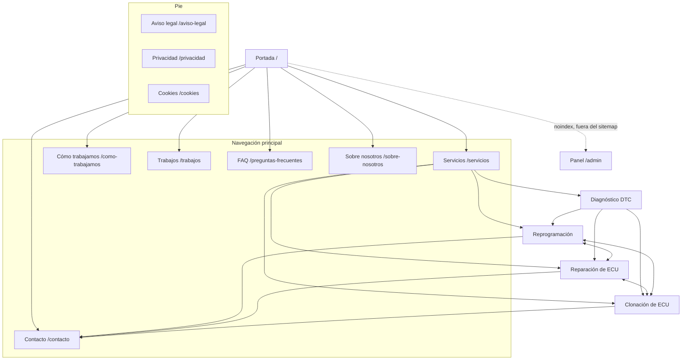

# Arquitectura de la web pública — JM Repro Cars

Fase 1 del frontend. Define URLs, jerarquía y navegación **antes** de diseñar, para
no tener que cambiar direcciones más adelante.

Elaborado con la skill `site-architecture`. Nada de lo que hay aquí está desplegado.

---

## 1. Objetivos de la web pública

Por orden de importancia:

1. **Convertir a WhatsApp.** El negocio ya funciona por WhatsApp y el backend está
   construido alrededor de ese flujo. La web existe para que un visitante entienda
   qué se hace y abra una conversación con contexto útil (vehículo, síntoma, fotos
   del error).
2. **Dar credibilidad técnica.** El público principal son otros talleres. Necesitan
   ver competencia real, no marketing genérico.
3. **Ser encontrable.** Búsquedas de servicio y de problema concreto («reparar
   centralita», «clonar ECU», «error DTC no arranca»).
4. **Sostener el crecimiento.** La estructura debe admitir casos reales, preguntas
   frecuentes y contenido técnico sin rehacer URLs.

**No** es objetivo de esta fase vender online. La tienda WooCommerce de la web
antigua queda fuera hasta que se confirme (§8).

---

## 2. Audiencias

Marcadas explícitamente: **solo la primera está confirmada** por el modelo de negocio
y el flujo de WhatsApp ya implementado. Las demás son hipótesis a validar con el
cliente.

| Audiencia | Estado | Qué busca | Qué necesita encontrar |
|---|---|---|---|
| **Talleres y profesionales** | Confirmada — la web antigua dice literalmente «Ofrecemos sobre todo para talleres» | Resolver una avería que no pueden cerrar | Qué servicios hay, qué datos enviar, contacto rápido |
| Particulares con avería | Hipótesis | Que su coche vuelva a arrancar | Explicación en lenguaje llano, confianza, contacto |
| Particulares de tuning | Hipótesis | Más potencia | Qué es una reprogramación, límites legales |
| Competición | Hipótesis — la web antigua menciona «vehículos de competición» | Anulaciones y preparaciones específicas | Alcance real y advertencia legal |

**Consecuencia de diseño:** la portada debe funcionar para un profesional con prisa
*y* para un particular desorientado. Se resuelve con jerarquía, no con dos webs:
titular claro, servicios explícitos, y un camino corto a WhatsApp desde cualquier
punto.

---

## 3. Sitemap público recomendado

Estado: ✅ implementada · ◻︎ planificada

```
Portada (/)                                              ✅
├── Servicios (/servicios)                               ✅
│   ├── Diagnóstico DTC (/servicios/diagnostico-dtc)     ✅
│   ├── Reprogramación (/servicios/reprogramacion)       ✅
│   ├── Reparación de ECU (/servicios/reparacion-ecu)    ✅
│   └── Clonación de ECU (/servicios/clonacion-ecu)      ✅
├── Cómo trabajamos (/como-trabajamos)                   ✅
├── Sobre nosotros (/sobre-nosotros)                     ✅
├── Contacto (/contacto)                                 ✅
├── Trabajos (/trabajos)                    ← fase posterior
│   └── Caso (/trabajos/{slug})             ← fase posterior
├── Preguntas frecuentes (/preguntas-frecuentes)
└── Legal
    ├── Aviso legal (/aviso-legal)
    ├── Privacidad (/privacidad)
    └── Cookies (/cookies)
```

Dos niveles como máximo. Toda página relevante queda a un clic de la portada, muy
por debajo de la regla de los tres clics. Es un sitio de negocio local pequeño: no
necesita más profundidad y añadirla solo escondería contenido.

### Visual



---

## 4. Jerarquía de navegación

### Cabecera

**Regla:** la cabecera solo muestra destinos que sean **una página pública
real**. Un enlace en la barra principal promete una página; llevar a un ancla
dentro de otra rompe esa promesa, y además hace que dos secciones compitan con
la página que las contiene.

```
[BrandMark]   Servicios ▾   Cómo trabajamos   Sobre nosotros   Contacto   [WhatsApp]
              ├─ Todos los servicios
              ├─ Diagnóstico DTC
              ├─ Reprogramación
              ├─ Reparación de ECU
              └─ Clonación de ECU
```

**El cuarto servicio no toca la barra.** Añadirlo fue rellenar su `page` en
`web/src/config/site.ts`: entra solo en el desplegable, en el pie, en las
tarjetas de la portada, en el raíl de `/servicios`, en la 404 y en `/contacto`.
Eso es exactamente lo que el desplegable estaba ahí para permitir, y es la
prueba de que agrupar fue la decisión correcta y no un apaño.

**La barra está llena, y lo que la llena son los destinos sueltos, no los
servicios.** Tres sueltos —«Cómo trabajamos», «Sobre nosotros», «Contacto»— más
el desplegable y el botón de WhatsApp es lo que cabe a 1024 px sin partir una
etiqueta en dos líneas, y partirla rompe `--header-height`, que es lo que usan el
índice pegajoso de `/servicios` y todos los `scroll-margin`. Un servicio nuevo
cabe siempre, porque va dentro del desplegable; **la cuarta página de nivel 1 no
cabrá**, y entonces la salida es agrupar, como se agruparon los servicios, no
encoger nombres. Ver el detalle medido más abajo.

**La barra horizontal aparece a partir de 1024 px**, no de 768. Entre 768 y
1023 px se usa el mismo menú desplegable que en móvil, que ya lista todo.

**«Preguntas habituales» no está en la cabecera**: es un ancla de
`/servicios`. Sigue alcanzable desde el pie, desde el menú móvil y desde
enlaces contextuales, que es donde ayuda sin engañar.

**«Cómo trabajamos» sí está, desde que es una página.** Estuvo fuera todo el
tiempo que fue un ancla —`/servicios#proceso`—, que es exactamente lo que
manda la regla de arriba. Al escribirse `/como-trabajamos` pasó a ser un
destino real y volvió a la barra; el pie y el menú de móvil apuntan ya a la
página, no al ancla. El ancla `#proceso` sigue existiendo en `/servicios`
porque esa sección sigue estando ahí, pero ya no la enlaza ninguna navegación.

### El desplegable de «Servicios», y por qué ahora sí

La versión anterior de este documento dejaba escrito el criterio: *«se replantea
cuando exista también `/servicios/clonacion-ecu`»*. Ese momento llegó.

Con las tres páginas escritas, la lista plana pedía cuatro destinos más el botón
de WhatsApp. Medido: a 1024 px eso no cabe sin partir una etiqueta en dos
líneas, y cuando la cabecera crece de 77 px a 92 px **`--header-height` deja de
ser cierto**, que es el token del que dependen el índice pegajoso de
`/servicios` y todos los `scroll-margin` de anclas. La salida no era acortar
nombres —«Reparación» a secas dice menos que «Reparación de ECU»— sino agrupar
lo que ya era un grupo: los tres servicios cuelgan de `/servicios`.

Cómo está hecho, y qué se exige de él:

- Es un **`<details>`**, el mismo elemento que el menú de móvil. Funciona sin
  JavaScript, expone `aria-expanded` de serie, se abre con teclado y **no
  depende de `hover`**, que en una pantalla táctil no existe.
- El disparador **no es un enlace**, así que no hay dos destinos compitiendo ni
  dos estados activos: dentro del panel, la página actual lleva
  `aria-current="page"`; el disparador solo se marca con el pad de cobre cuando
  estás en cualquier página de servicios.
- «Todos los servicios» es la primera entrada del panel: el hub sigue estando a
  un clic.
- El script de la web pública añade lo que el elemento no trae —cerrar al pulsar
  fuera, con Escape y al salir el foco—, y el menú sigue siendo usable si ese
  script no llega.
- Verificado con navegador real a 768, 1024 y 1280 px: la cabecera mide 77 px en
  las cinco páginas indexables, y cada página de servicios marca exactamente un
  destino dentro del panel. La portada no marca ninguno, que es lo correcto.

Al lado del desplegable van las páginas de nivel 1 que ya existen, en el array
`PAGES` de `SiteHeader.astro`: **«Cómo trabajamos», «Sobre nosotros» y
«Contacto»**. Medido con navegador real a 768, 1024, 1280, 1440 y 1920 px con
las tres: la cabecera sigue midiendo 77 px y la barra no se parte.

**Con tres, la barra está llena.** Caben porque el relleno horizontal de los
enlaces baja de 0,875 rem a 0,5 rem entre 1024 y 1280 px, y vuelve a su sitio a
partir de ahí: encoger espacio en blanco es reversible y no le quita
información a nadie; encoger un nombre, sí. **La cuarta página de nivel 1 ya no
cabrá**, y entonces la salida es la misma que con los servicios —agrupar bajo un
desplegable—, nunca partir una etiqueta en dos líneas.

El campo `page` de cada servicio en `web/src/config/site.ts` gobierna esto: la
cabecera se construye filtrando por él, así que crear una página nueva la añade
sola.

Lo demás de la cabecera, sin cambios:

- `Trabajos` **no se muestra hasta que existan casos reales autorizados**. Aparece en
  la arquitectura para reservar la URL, no en la interfaz. La portada tampoco
  reserva ya un hueco visible para esa sección: el recuadro vacío que anunciaba
  su ausencia se sustituyó por el bloque de entrada («qué conviene enviarnos»),
  que sí tiene contenido verdadero. La URL sigue reservada.
- La llamada a la acción es un botón a WhatsApp, siempre el último por la derecha.
- El `BrandMark` enlaza a `/`.

### Pie

**Un único bloque oscuro**, dividido internamente por líneas, no por cambios de
fondo: marca, servicios, empresa, contacto y franja legal. Encadenar varias
bandas oscuras hace que parezcan varios pies de página.

| Marca | Servicios | Empresa | Contacto |
|---|---|---|---|
| Descripción breve | Todos los servicios | Cómo trabajamos | WhatsApp |
| | Los tres servicios | Preguntas habituales | Plantillas por servicio → `/contacto` |

`/contacto` va en la columna de contacto y **no** en la de empresa: quien busca
cómo escribir mira ahí, no en la lista de páginas. Y el enlace se llama por lo
que ofrece —plantillas por servicio—, no «Contacto» otra vez debajo de un
epígrafe que ya se llama así.

Las páginas legales se añadirán cuando existan los datos fiscales del cliente.

### Migas de pan

En las páginas de nivel 2 (`/servicios/*` y, más adelante, `/trabajos/*`). Reflejan
exactamente la ruta de la URL:

```
Inicio > Servicios > Reprogramación
```

Cada segmento enlaza salvo el actual. No se ponen en la portada ni en las páginas de
nivel 1: no aportan nada y añaden ruido.

---

## 5. Patrones de URL

| Regla | Decisión |
|---|---|
| Idioma | Castellano. El público es español; los slugs también |
| Separador | Guion medio |
| Mayúsculas | Nunca. `/Servicios` redirige a `/servicios` |
| Barra final | **Sin barra final.** `/servicios/` redirige a `/servicios` |
| Fechas en URL | No. La web antigua tenía `/2025/02/28/hello-world/`; no se repite |
| Identificadores | No. Slugs legibles siempre |
| Profundidad | Máximo dos niveles |

**Mientras un servicio no tenga página individual**, sus enlaces apuntan a un
ancla dentro de `/servicios`. Hoy los tres la tienen, así que no queda ningún
enlace de esa clase; la regla se mantiene escrita para el próximo servicio que
se añada.

Ningún enlace del sitio apunta a una página inexistente, y hay pruebas que lo
comprueban (`web/test/navigation.test.ts`): recorren `src/pages` y fallan si
algún `href` o `page` de `src/config/site.ts` apunta a un archivo que no existe.
Desde la fase de clonación **se revisan también los `href` escritos a mano** en
todas las plantillas de `src/pages`, `src/components` y `src/layouts`, que es
justo el caso que aparece al crear una página nueva: el enlace provisional hacia
el ancla que la sustituía se queda atrás y en el HTML generado no se distingue
de uno bueno. El campo `page` es lo único que hay que rellenar al crear una
página: la cabecera, el pie, las tarjetas de la portada y los enlaces laterales
se actualizan solos.

| Tipo de página | Patrón | Ejemplo |
|---|---|---|
| Portada | `/` | `/` |
| Hub de servicios | `/servicios` | `/servicios` |
| Servicio | `/servicios/{slug}` | `/servicios/diagnostico-dtc` |
| Página simple | `/{slug}` | `/como-trabajamos` |
| Caso real (futuro) | `/trabajos/{slug}` | `/trabajos/audi-a3-egr` |
| Legal | `/{slug}` | `/privacidad` |
| Panel privado | `/admin`, `/admin/{sección}` | `/admin/solicitudes` |

**Sobre la barra final:** la web antigua es WordPress y usa barra final en todo. La
nueva usa `trailingSlash: "never"` en Astro con `build.format: "file"`, de modo que
cada ruta genera un `.html` servido sin barra. **Requiere una regla en el servidor
web** cuando llegue el reverse proxy: redirección 301 de `/ruta/` a `/ruta`. Queda
anotado como dependencia de la fase de despliegue.

---

## 6. Estrategia de enlaces internos

No hay blog ni cientos de páginas, así que el modelo hub-and-spoke se aplica en
pequeño y sin artificios.

**Hub: `/servicios`.** Enlaza a los cuatro servicios; cada servicio enlaza de
vuelta al hub por las migas y **lateralmente a los demás**. Esto evita que las
páginas queden aisladas entre sí, que es el fallo típico de estas estructuras.

**`/servicios/diagnostico-dtc` es el nuevo nodo de entrada.** No es una cuarta
intervención: es el análisis que decide **cuál** de las tres hace falta, o si no
hace falta ninguna. Por eso abre la lista de servicios, por eso su enlace lateral
se titula «Y si la respuesta es hacer algo, esto es lo que hacemos» y por eso
también enlaza a `/como-trabajamos`. En la configuración esa diferencia es el
campo `kind`, y `INTERVENTIONS` es la lista de las tres: las frases del sitio que
enumeran en qué puede acabar un caso —en `/como-trabajamos` y en
`/sobre-nosotros`— usan esa lista, no `SERVICES`, porque un diagnóstico no es un
desenlace.

**`/como-trabajamos` es el otro nodo que enlaza a los tres servicios**, desde
el texto que cierra su esquema: qué se acaba haciendo depende de lo que se
encuentre al revisar. Y al revés, el bloque de proceso de la portada y de
`/servicios` enlaza a `/como-trabajamos`, que es la versión larga de lo que
ellos resumen en cuatro pasos.

La forma del enlace lateral entre servicios no es la misma en las tres páginas,
y es deliberado. Reprogramación y reparación cierran con «¿No es esto lo que
necesitas?»; **clonación lo resuelve con una comparación de los tres servicios**
—sobre qué actúa cada uno, si la unidad del vehículo sigue siendo la misma y
para qué sirve—, con el enlace dentro de cada columna. Hace el mismo trabajo y
además responde a la confusión concreta de esa página, que es exactamente en qué
se diferencia clonar de reprogramar y de reparar.

**Reglas que se aplican:**

- Ninguna página huérfana: todas cuelgan de la cabecera, del pie o del hub.
- Texto de enlace descriptivo. Nunca «pincha aquí» ni «leer más» sueltos: el enlace
  dice a dónde va («ver cómo reparamos una centralita»).
- La portada enlaza a los tres servicios por su nombre, no a `/servicios` solamente.
- `/como-trabajamos` enlaza a los tres servicios y al contacto: es la página que
  convierte al indeciso.
- **`/contacto` es el tercer nodo que enlaza a los tres servicios**, uno por
  tarjeta («qué hacemos en reparación de ECU»), y cierra enlazando a
  `/servicios` y a `/como-trabajamos` para quien ha llegado sin decidir. No
  recibe enlaces laterales desde las páginas de servicio: ésas ya llevan a
  WhatsApp directamente, y mandar antes a `/contacto` sería un rodeo.
- Cuando existan casos reales, cada caso enlazará al servicio que le corresponde, y
  cada servicio mostrará sus casos. Ese enlace cruzado es el que da valor a
  `/trabajos`, y es la razón de reservar ya la URL.
- Las páginas legales se enlazan solo desde el pie. No compiten por atención.

**Enlaces que la web pública NO debe tener:** ninguno a `/admin`. El panel no se
anuncia (§9).

---

## 7. Inventario de la web antigua

Recogido de `sitemap_index.xml` y de las páginas el 2026-08-20. Sirve para no perder
direcciones, no como referencia de diseño ni de contenido.

| URL antigua | Qué es | Estado observado |
|---|---|---|
| `/` | Portada | Activa |
| `/services/` | Servicios | Activa. Lista DTCs, reparaciones internas, repros, pop&bang/hardCut, anulaciones, immo off |
| `/about/` | Sobre nosotros | Activa. Contiene afirmaciones a verificar (§8) |
| `/contact/` | Contacto | Activa. WhatsApp y correo; avisa de que el buzón está «temporalmente deshabilitado» |
| `/sample-page/` | Enlazada en el menú como **«Repros»** | Slug por defecto de WordPress. URL de baja calidad |
| `/team/` | Equipo | En el sitemap; contenido de plantilla |
| `/blog/` | Índice del blog | Un solo post |
| `/2025/02/28/hello-world/` | Post de ejemplo de WordPress | Contenido de plantilla |
| `/tienda/` | Tienda WooCommerce | Pendiente de decisión (§8) |
| `/carrito/` | Carrito WooCommerce | Página funcional de la tienda |
| `/finalizar-compra/` | Checkout WooCommerce | Página funcional de la tienda |
| `/mi-cuenta/` | Cuenta de cliente WooCommerce | Página funcional de la tienda |

### Hechos verificables recuperados

Utilizables porque están publicados por el propio cliente:

- WhatsApp y teléfono: **+34 687 393 573**.
- Correo: **Hiperjomi@gmail.com** (con el aviso de buzón deshabilitado).
- Trabaja **sobre todo para talleres**.
- Vehículos atendidos: coches, camiones, motos, barcos y motos de agua.
- Incluye un **aviso legal explícito** de que las anulaciones están prohibidas en
  ciertos ámbitos y solo se admiten para competición o pruebas.

### Afirmaciones que NO se reutilizan sin confirmación

La página `/about/` dice: «Con casi 30 años de experiencia y más de 10.000 vehículos
potenciados, podemos decir que somos una de las empresas más pioneras del sector.»

No son datos inventados por nosotros, pero **tampoco están verificados**. No se
trasladan a la web nueva hasta que el cliente los confirme por escrito. Lo mismo
aplica a cualquier cifra, premio o certificación.

---

## 8. Mapa provisional de redirecciones

Todas 301 permanentes. Se implementan en el servidor web o en la configuración de
Astro cuando exista despliegue; **no** en esta fase.

| Origen | Destino | Motivo |
|---|---|---|
| `/services/` | `/servicios` | Traducción del slug |
| `/about/` | `/sobre-nosotros` | Traducción del slug |
| `/contact/` | `/contacto` | Traducción del slug |
| `/team/` | `/sobre-nosotros` | El equipo se integra en «Sobre nosotros» |
| `/sample-page/` | `/servicios/reprogramacion` | Era el enlace «Repros» del menú |
| `/blog/` | `/` | Sin contenido real. Revisar si se retoma el blog |
| `/2025/02/28/hello-world/` | `/` | Post de ejemplo |
| `/{ruta}/` | `/{ruta}` | Política de barra final |

**Pendientes de decisión** (§9): `/tienda/`, `/carrito/`, `/finalizar-compra/`,
`/mi-cuenta/`. Si la tienda se retira, lo correcto es `410 Gone` para el catálogo y
301 a `/contacto` para las páginas de proceso. Si se mantiene, la tienda necesita
fase propia: WooCommerce no se reimplementa en Astro a la ligera.

---

## 9. Separación entre público y panel

| | Web pública | Panel privado |
|---|---|---|
| Rutas | Todas menos `/admin*` | `/admin`, `/admin/login`, `/admin/*` |
| Indexación | Indexable | `noindex, nofollow` en todas |
| Sitemap | Incluida | **Excluida** |
| `robots.txt` | Permitida | `Disallow: /admin` |
| Navegación pública | Enlazada | **Sin ningún enlace** desde la web pública |
| Render | Estático | Cliente, tras validar sesión contra la API |
| Datos | Ninguno privado | Nada en el HTML inicial sin sesión válida |

`robots.txt` y `noindex` son señales para buscadores, **no seguridad**. La protección
real es la sesión del backend, ya implementada y probada. La interfaz no es una
barrera: es cortesía.

---

## 10. Páginas previstas para fases posteriores

Reservadas en la arquitectura, sin implementar:

| Página | URL | Requiere |
|---|---|---|
| ~~Diagnóstico DTC~~ | ~~`/servicios/diagnostico-dtc`~~ | **Escrita.** No estaba prevista en la primera versión de esta arquitectura: se añadió al confirmar el cliente que su especialidad es el software —«repros, DTCs, etc.»—, y la web antigua ya listaba DTCs entre sus servicios (§7). Ver §11 |
| Trabajos | `/trabajos` | Casos reales autorizados y fotos con permiso |
| ~~Cómo trabajamos~~ | ~~`/como-trabajamos`~~ | **Escrita.** Ver §4 |
| ~~Contacto~~ | ~~`/contacto`~~ | **Escrita.** Ver §4 y §11 |
| Caso | `/trabajos/{slug}` | Lo mismo |
| Preguntas frecuentes | `/preguntas-frecuentes` | Preguntas reales de clientes |
| ~~Sobre nosotros~~ | ~~`/sobre-nosotros`~~ | **Escrita como maqueta.** Ver §11 |
| Cobertura / envíos | `/envios` | Confirmar si se trabaja por mensajería |
| Tienda | `/tienda` | Decisión sobre WooCommerce |
| Blog técnico | `/blog` y `/blog/{slug}` | Compromiso real de escribir |

Reservar la URL cuesta cero. Cambiarla después de estar indexada, no.

---

## 11. Datos del cliente pendientes de confirmar

Bloquean contenido, no arquitectura. La web se puede construir sin ellos y añadirlos
después sin tocar URLs.

**Identidad y contacto**

- [ ] Logo definitivo (hoy hay un wordmark provisional sustituible).
- [ ] ¿Se publica la dirección física? ¿Se atiende presencialmente o solo por envío?
      **Hay una dirección provisional sin confirmar**, guardada en
      `CONTACT_PENDING_CONFIRMATION` (`web/src/config/site.ts`) y **sin publicar
      en ninguna página**: Av. Reyes Católicos, 15 · 18194 Churriana de la Vega,
      Granada. Al confirmarse hay que decidir además si `/contacto` muestra mapa
      y si los datos estructurados pasan de `Organization` a `AutoRepair`.
- [ ] Horario de atención. `/contacto` **no publica ninguno**: dice «visitas con
      cita previa», que sí está confirmado.
- [ ] ¿El teléfono +34 687 393 573 sigue vigente y es público?
- [ ] ¿Correo de contacto operativo? El actual figura como deshabilitado. **Hay
      un correo provisional sin confirmar** en `CONTACT_PENDING_CONFIRMATION`,
      también sin publicar. Una prueba (`web/test/contact.test.ts`) falla si
      alguno de los dos aparece en una plantilla o en una página.
- [ ] Perfiles reales de redes sociales, si existen.

**Datos legales** (obligatorios en España)

- [ ] Razón social o nombre y apellidos del titular.
- [ ] NIF/CIF.
- [ ] Domicilio fiscal.
- [ ] Correo de contacto legal.

**Contenido de `/sobre-nosotros`** — la página está escrita, pero **todo su
contenido sobre el cliente es provisional**. Vive en `ABOUT`
(`web/src/config/site.ts`), marcado `PENDING_CLIENT_CONFIRMATION`, y el listado
que hay que repasar con él está en `ABOUT_TO_CONFIRM`, en el mismo archivo, con
la procedencia de cada dato: qué lo ha dicho el cliente, qué sale de su web
actual y qué se ha escrito para poder enseñar la maqueta.

A diferencia de `CONTACT_PENDING_CONFIRMATION`, **esto sí se publica**: son
datos que no comprometen a nadie —ni dirección, ni correo, ni cifras de
resultados—, y una maqueta que no se ve no se puede corregir. Los dos conflictos
conocidos:

- [ ] **Años de experiencia.** La maqueta publica «más de 20 años»; la web
      actual dice «casi 30». Hay que elegir una y sostenerla.
- [ ] **Vehículos atendidos.** La maqueta dice «coches, motos y vehículos
      comerciales»; la web actual y nuestra portada dicen además camiones,
      barcos y motos de agua.

**Contenido comercial**

- [ ] ¿Se confirman los «casi 30 años» y los «10.000 vehículos»?
- [ ] Precios y plazos, si se publican.
- [ ] ¿Hay garantía? ¿En qué términos?
- [ ] Marcas o modelos con los que se trabaja habitualmente.
- [ ] Fotografías propias del taller y de trabajos reales, con permiso de uso.
- [ ] Testimonios autorizados.
- [ ] ¿Se mantiene la tienda?
- [ ] **Confirmar el alcance del diagnóstico DTC.** El cliente ha dicho que su
      especialidad es el software —«repros, DTCs, etc.»— y la web lo posiciona
      así. `/servicios/diagnostico-dtc` está escrita **en términos de método**:
      explica qué se mira y qué desenlaces hay, y no afirma qué marcas, qué
      gestiones, qué herramientas ni qué tipos de caso se atienden. Lo que hay
      que confirmar: si atiende diagnosis a distancia, si trabaja con la
      diagnosis del taller o exige la unidad, y qué casos descarta de entrada.
- [ ] Confirmar el alcance de «clonación de ECU»: la web antigua no la menciona con
      ese nombre, aunque sí figura en el modelo de datos del backend.
      **`/servicios/clonacion-ecu` ya está escrita, y a propósito en términos
      generales**: explica qué clase de información se traslada de una unidad a
      otra compatible y dice expresamente que depende de la unidad. No afirma
      qué marcas, gestiones o casos concretos se atienden, ni que se copie
      siempre todo. Cuando el cliente confirme el alcance real, es la página que
      hay que revisar primero.

Mientras no lleguen, el contenido provisional vive centralizado en un único archivo
de configuración del sitio, no repartido por las plantillas.
